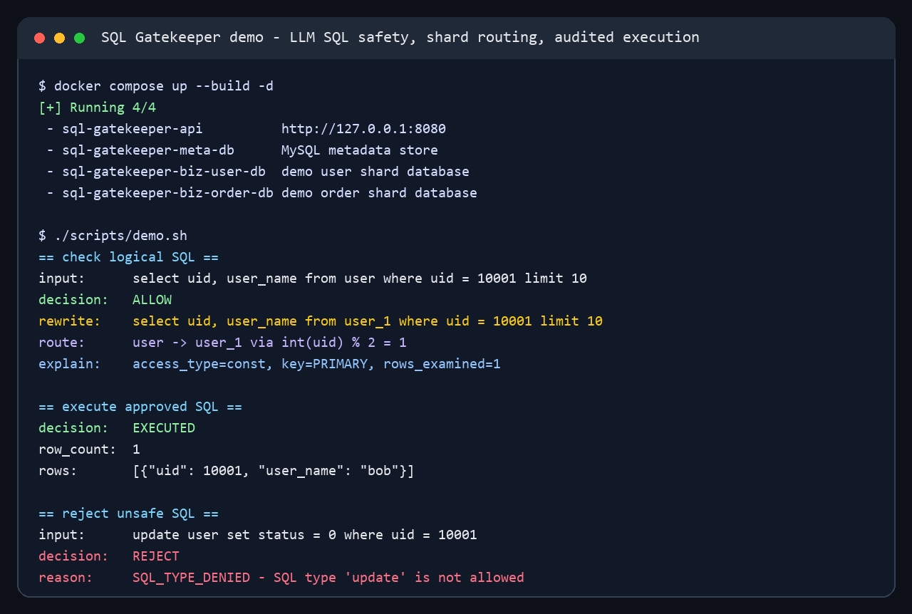
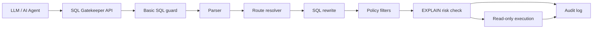

# SQL Gatekeeper

[](https://github.com/TheCactuslxf/sql-gatekeeper/actions/workflows/ci.yml)
[](https://www.python.org/)
[](LICENSE)

> A production-oriented MySQL gateway for LLM-generated SQL: route logical tables to shards, rewrite SQL, run EXPLAIN-based safety checks, execute read-only queries, and audit every request.

SQL Gatekeeper sits between an AI agent and MySQL. It lets the agent write simple logical SQL while the gateway decides whether the query is safe, maps logical tables to physical shards, rewrites the SQL, checks the execution plan, and records the decision.





## Why This Exists

Letting an LLM talk to a database is useful, but raw SQL execution is a risky boundary:

- The model can generate writes, multi-statements, missing limits, or expensive scans.
- Prepared statements and ORM escaping do not solve the problem when the model controls the query shape.
- Production schemas often use logical tables, physical shards, and routing metadata that the model should not need to know.
- Teams need an audit trail for both approved and rejected AI-generated queries.

SQL Gatekeeper is built for that boundary.

## What It Does

- Accepts SQL generated by an LLM or agent.
- Supports MySQL logical-table queries such as `select * from user where uid = 10001 limit 10`.
- Resolves route factors from SQL predicates or request context.
- Rewrites logical tables to registered physical tables, such as `user` to `user_1`.
- Rejects non-`SELECT` statements, multi-statements, missing `LIMIT`, oversized `LIMIT`, cross-datasource joins, and unsafe execution plans.
- Uses MySQL `EXPLAIN` to block large scans, `Using temporary`, and `Using filesort` according to policy.
- Executes approved SQL with read-only datasource credentials.
- Writes audit records for checks and executions.

## Quick Start

Clone the project and start the full demo stack:

```bash
git clone https://github.com/TheCactuslxf/sql-gatekeeper.git
cd sql-gatekeeper
docker compose up --build
```

This starts:

- the SQL Gatekeeper API on `http://127.0.0.1:8080`
- a metadata MySQL instance
- a demo user MySQL instance
- a demo order MySQL instance

The API container automatically creates metadata tables and seeds demo routing rules on startup.

Check the service:

```bash
curl -s http://127.0.0.1:8080/health
```

Check a logical SQL query:

```bash
curl -s http://127.0.0.1:8080/api/v1/sql/check \
  -H "content-type: application/json" \
  -d '{
    "request_id": "demo-001",
    "operator": "ai-agent",
    "scene": "demo",
    "sql": "select uid, user_name from user where uid = 10001 limit 10",
    "route_context": {}
  }'
```

Execute the approved query:

```bash
curl -s http://127.0.0.1:8080/api/v1/sql/execute \
  -H "content-type: application/json" \
  -d '{
    "request_id": "demo-002",
    "operator": "ai-agent",
    "scene": "demo",
    "sql": "select uid, user_name from user where uid = 10001 limit 1",
    "route_context": {}
  }'
```

Or run the demo script:

```bash
./scripts/demo.sh
```

On Windows PowerShell:

```powershell
.\scripts\demo.ps1
```

Stop the demo stack:

```bash
docker compose down -v
```

### Local Development

If you prefer to run the API directly on your machine, install the package and start only the MySQL services:

```bash
python -m venv .venv
source .venv/bin/activate
pip install -e ".[dev]"
docker compose up -d meta-db biz-user-db biz-order-db
python -m sql_gatekeeper.bootstrap.meta
uvicorn sql_gatekeeper.api.app:app --host 127.0.0.1 --port 8080
```

Expected result:

```json
{
  "allowed": true,
  "reason_code": "ALLOW",
  "rewritten_sql": "select uid, user_name from user_1 where uid = 10001 limit 10",
  "logical_tables": ["user"],
  "physical_tables": ["user_1"],
  "datasource_codes": ["biz_user_db"]
}
```

## API

### `POST /api/v1/sql/check`

Returns the decision, rewritten SQL, route diagnostics, and EXPLAIN summaries without executing the query.

### `POST /api/v1/sql/execute`

Runs the same safety pipeline, then executes approved SQL with read-only datasource credentials.

Request shape:

```json
{
  "request_id": "req-123",
  "operator": "ai-agent",
  "scene": "chatops",
  "sql": "select * from order where order_id = 'A1002' limit 1",
  "route_context": {
    "biz_date": "2025-07"
  }
}
```

## Routing Examples

The demo metadata includes two logical tables:

| Logical table | Route factor | Rule | Physical target |
| --- | --- | --- | --- |
| `user` | SQL predicate `uid` | `int(uid) % 2` | `user_0` or `user_1` |
| `order` | `route_context.biz_date` | `YYYY-MM` to `YYYY_MM` | `order_2025_06`, `order_2025_07` |

Example:

```sql
select order_id, amount from order where order_id = 'A1002' limit 1
```

With:

```json
{"biz_date": "2025-07"}
```

Rewrites to:

```sql
select order_id, amount from order_2025_07 where order_id = 'A1002' limit 1
```

For imported sharded tables, callers can provide the business shard column name while keeping the shard value in the logical SQL predicate:

```json
{
  "sql": "select count(1) as cnt from partner__partner_relation_info where from_uid = '97585024' limit 1",
  "route_context": {
    "shard_column": "from_uid"
  }
}
```

The service extracts the predicate value, computes the route from imported shard metadata, rewrites the logical table to the physical table, and runs the checked SQL. Callers do not need to calculate or provide `route_suffix`.

## Safety Checks

SQL Gatekeeper currently blocks:

- Empty SQL.
- Multi-statement SQL.
- Leading comments.
- `INSERT`, `UPDATE`, `DELETE`, `REPLACE`, `DROP`, `ALTER`, and `TRUNCATE`.
- Any non-`SELECT` statement.
- Unknown logical tables or unregistered physical tables.
- Missing required route factors.
- Cross-datasource joins.
- Missing `LIMIT` when policy requires it.
- `LIMIT` values above policy maximum.
- EXPLAIN plans that exceed scan thresholds.
- Full scans on large tables.
- `Using temporary` and `Using filesort` when policy rejects them.

## Architecture

| Module | Responsibility |
| --- | --- |
| API layer | FastAPI routes for check and execute |
| SQL parser | Extract SQL type, tables, aliases, predicates, and limit |
| Route decision engine | Resolve logical tables to datasource and physical table |
| SQL rewrite engine | Replace logical table tokens with physical table names |
| Filter chain | Apply policy, datasource, SQL type, limit, and EXPLAIN checks |
| Executor | Execute approved SQL with read-only credentials |
| Audit logger | Persist request, decision, rewritten SQL, and EXPLAIN summary |

## Development

Run unit tests that do not require Docker MySQL:

```bash
pytest tests
```

Run the full Docker-backed suite:

```bash
RUN_DOCKER_TESTS=1 pytest tests
```

Useful local commands:

```bash
make up
make bootstrap-dev
make test
make down
```

## Roadmap

- Replace the current lightweight regex parser with an AST-based parser such as `sqlglot`.
- Add PostgreSQL support.
- Add MCP server mode for AI agents.
- Add a policy DSL for tenant filters, table allowlists, and column deny lists.
- Add a small audit dashboard.
- Publish a Docker image and a PyPI package.

See [ROADMAP.md](ROADMAP.md) for more detail.

## Related Space

SQL Gatekeeper is similar in spirit to SQL guardrail projects for LLM applications, but it focuses on production MySQL access patterns where logical tables, shard routing, SQL rewriting, EXPLAIN risk checks, read-only execution, and auditing need to work together.

## License

MIT. See [LICENSE](LICENSE).
